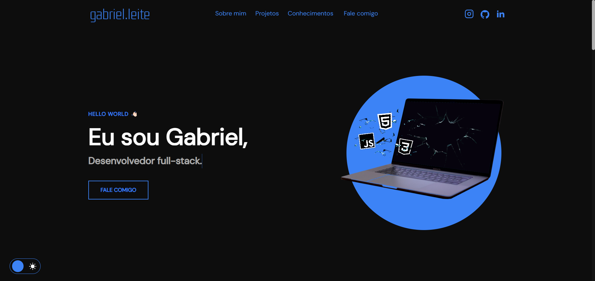

<h1 align="center">Portifólio - Gabriel 👨🏻‍💻</h1>

<h4 align="center"><a href="https://tech-gabriel.github.io/Meu-portifolio/">Confira o projeto aqui</a></h4>

---

## 👨🏻 Sobre

Projeto feito no intuito de me apresentar e centralizar meus projetos.

## 🦾 O site é composto por:

- **Home:** Minha apresentação;
- **Sobre mim:** Falo um pouco sobre minha trajetória e meu estado atual;
- **Projetos:** Em desenvolvimento, logo colocarei cards que levaram para os meus projetos;
- **Conhecimentos:** As tecnologias que tenho conhecimento;
- **Fale comigo:** Área com meios para contato comigo;
- **Redes:** Minhas redes sociais disponíveis no menu de navegação e no rodapé do site.

## 🧠 Tecnologias utilizadas:

O site **ainda está em desenvolvimento**, pois estou em constante aprendizado. Mas até aqui utilizei as tecnologias:

    
    
    

## 📚 Alguns conceitos aplicados

Neste projeto apliquei os seguintes pontos:

- Semântica HTML;
- Pontos de acessibilidade;
- Responsividade;
- Utilização da lib JS <a href="https://scrollrevealjs.org">Scroll Reveal</a>.

---

<table>
  <tr>
    <td>
      
    </td>
    <td>
      Feito por <a href="https://github.com/tech-gabriel">Gabriel Leite.</a> 🙋🏿‍♂️
    </td>
  </tr>
</table>
